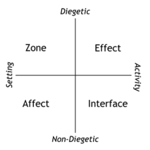
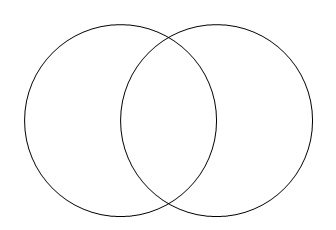

# Process
We will document our process in this folder

# 2026-10
Life in october

## 2026-10-06
** listening to Sabrina **    
Yesterday, we learned to shape a virtual reality with absolutely no framework.  
But we need the game we're going to create to be appelant to kids.  
This world could be : 
- fantasy
- solarpunk
- cottagecore
- high school drama
- supernatural
- gangster
- weirdcore 
- historic (victorian)

Could be a gangsta game in a Swiss city. OG-NEVA.  
Drugs = chocolate  
No guns  
Life : Cool points aura Battle : The cool system  
What are the resources : chocolate, fruits,  

The roles could be : 
- the dealer is selling black market items
- the consumer needs to hide chocolate in the city
- the officer can not catch the dealer
- the banker
- the killer
- the driver

UI : Cool bar, chat group (vocal/text/pictures), inventory, market, gang  

3 gangs 
- The warriors
- The skaters
- The alpinists
- The Head Axe
- The cheese mongers

What type of agency does the bully have in this world ?  
A system that allows bullying  
Someone has the role to stop the bully 

Rules
Each gang receives one advantage and one disavandtage 
Each has its own costum 
Hidden roles 
Gang and personal quests and earn and lose points of style 
Find bullies to get allies 
Inter dependancy

Attack
- a gang can throw fruits
- a gang can take humiliating photos of others 

throwing fruits - the same as throwing paper balls 
the police bullying people gets people frustrated  

Defense
- a gang can sell the chocolate
- a gang can dance only with a group 
- a gang can make videos to get likes

. 

- the dealer is selling black market items 

. 

Death of the game 
Design can not spoil the fun 
Subroles to collect everyone has money, to create interaction, some people can steau 

Identify how these things translate into reality ? 

The bystander effect
Not verbal communication
The world collides in the chat

diegetic / extra diegetic

## References

- Les guerriers de la nuit, The Warriors 1979
About the identity within gangs (racial, mixed)  

